<div align="center">
  
</div>

<br/>

<div align="center">

[](https://pypi.org/project/iocx/)
[](https://python.org)
[](LICENSE)
[](https://github.com/Nervi0z/iocx/stargazers)

</div>

<br/>

I spent several years as a Tier 1 analyst in a SOC focused on detection and response. The golden rule of the job: save time and leave evidence of your investigation. Every minute spent cross-referencing an IP across three different sources is a minute not spent on the next alert. iocx was built from that need — a single command that queries everything at once and generates a report ready to attach to the ticket.

Since January I have been working in vulnerability analysis within the same SOC. I wanted to share it in case it makes someone else's life easier. If you work in blue team, this is for you.

Accepts both plain and defanged IOC formats — `malo[.]com`, `hxxps://evil[.]ru`, `192.168[.]1.1` — normalized automatically before querying.

---

```
$ iocx scan hosts.txt --output report.html
```

```
Loaded 4 targets — querying...
  ip      185.220.101.45
  domain  malo.com
  ip      8.8.8.8
  domain  update-service.net

Report saved to report.html
  4 targets · 2 HIGH · 1 MEDIUM · 1 CLEAN
```

The HTML report opens in the browser with a risk-colored table and a direct link to each OSINT source — ready to attach to a ticket or send to a client.

---

## Install

```bash
pip install iocx
```

No configuration required. Works from the first command.

---

## Commands

```bash
iocx ip 185.220.101.45                       # IP reputation
iocx hash d41d8cd98f00b204e9800998ecf8427e   # MD5 / SHA1 / SHA256
iocx domain evil-c2.ru                       # domain reputation + DNS
iocx url "hxxps://malware[.]ru/drop.exe"     # URL (defanged format OK)
iocx scan hosts.txt --output report.html     # scan list and generate HTML report
iocx scan hosts.txt --output report.txt      # plain text report
iocx decode SGVsbG8gV29ybGQ=                 # auto-detect encoding
iocx config set virustotal YOUR_API_KEY      # store API key
iocx config list                             # show configured keys
```

All commands accept `--json` for piping to other tools.

---

## API keys (optional)

Without keys, iocx uses open sources: ip-api.com, MalwareBazaar, URLhaus and public DNS. With keys, VirusTotal, AbuseIPDB and Shodan activate automatically.

AbuseIPDB and VirusTotal API keys are free with registration. Shodan's free tier has query limitations — check their documentation before using it in production.

```bash
iocx config set virustotal YOUR_KEY
iocx config set abuseipdb  YOUR_KEY
iocx config set shodan      YOUR_KEY
```

Keys are stored in `~/.iocx/config.json` and loaded automatically on every run. Environment variables also work: `VT_API_KEY`, `ABUSEIPDB_API_KEY`, `SHODAN_API_KEY`.

---

## Target file

`iocx scan` accepts IPs and domains mixed in the same file, including defanged formats used in threat intelligence reports:

```
# hosts.txt — comments are ignored
185.220.101.45
malo[.]com
hxxps://evil[.]ru/payload.exe
192.168[.]1[.]100
update-service[.]net
8.8.8.8
```

The formats `[.]`, `(.)`, `[dot]`, `hxxp://`, `hxxps://` are normalized automatically before any query is made. Both sanitized and unsanitized IOCs work.

---

## HTML report

```bash
iocx scan hosts.txt --output report.html
```

Generates a self-contained HTML file with:

- Risk-colored table: HIGH / MEDIUM / LOW / CLEAN
- Score from each queried source
- Direct link to the source page for each IOC
- Executive summary with counts
- Ready to attach to a ticket, email or incident report

---

## Sources

| Source | Type | Key required |
|--------|------|:---:|
| [ip-api.com](https://ip-api.com) | Geolocation, ASN, hosting/proxy detection | No |
| [AbuseIPDB](https://www.abuseipdb.com) | IP reputation, abuse reports | Yes (free) |
| [VirusTotal](https://www.virustotal.com) | IP / hash / domain / URL | Yes (free) |
| [Shodan](https://www.shodan.io) | Open ports, banners, CVEs, tags | Yes (limited free) |
| [MalwareBazaar](https://bazaar.abuse.ch) | Hash lookup, malware family, tags | No |
| [URLhaus](https://urlhaus.abuse.ch) | Malware distribution by URL/domain | No |
| DNS | System resolver | No |

---

## Decode

```bash
iocx decode SGVsbG8gV29ybGQ=
# base64 → Hello World

iocx decode "eyJhbGciOiJIUzI1NiJ9.eyJzdWIiOiJ0ZXN0In0.abc"
# JWT → header + payload (signature not verified)

iocx decode 48656c6c6f
# hex → Hello
```

Auto-detects: base64, base64url, double-encoded base64, hex, URL encoding, JWT, ROT13.

---

## JSON output

```bash
iocx ip 1.2.3.4 --json | jq '.results[] | select(.source == "AbuseIPDB") | .score'
iocx scan hosts.txt --json | jq '.ips'
iocx decode SGVsbG8= --json
```

---

## Contributing

See [CONTRIBUTING.md](CONTRIBUTING.md). Open an issue before large changes.

To add a new source: add the function in `src/iocx/sources.py`, wire it into `cli.py` and add tests.

---

## License

MIT — see [LICENSE](LICENSE).

---

<div align="center">
  <sub>
    <a href="https://github.com/Nervi0z">@Nervi0z</a> · Security Analyst · VAR Group Madrid ·
    <em>find it // triage it // chase the fix</em>
  </sub>
</div>
